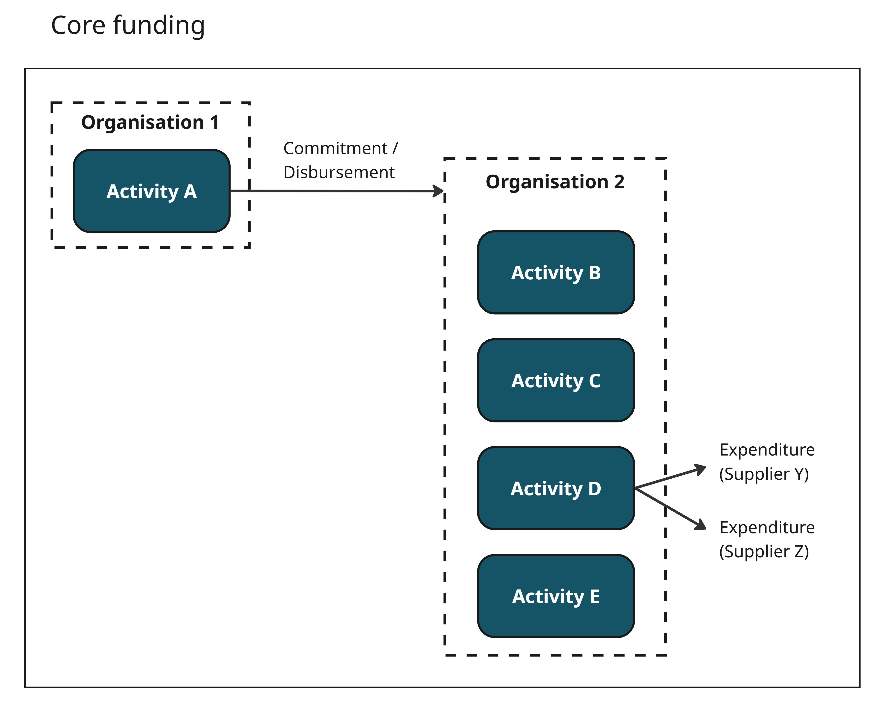

.. _`core_funding`:
******************
4) Core funding
******************

Core funding describes situations where your organisation receives unearmarked funding, from which you fund one or more activities.

This often applies to multilateral organisations that pool funds from several donors.

Scenario
---------

- Organisation 1 funds Organisation 2 (core funding).
- Organisation 2 carries out Activities B1 and B2 from the core funding.

---------------------------------------------------------------------------------------------------------------------------------------

**Example:** UNICEF is a multilateral organisation that receives funding from multiple donors, some of which is unearmarked core funding.

* Activity A: `UK core support to the United Nations Children's Fund (UNICEF), covering 2023 - 2025 <https://d-portal.iatistandard.org/ctrack.html#view=act&aid=GB-GOV-1-301509-104>`_ (UK FCDO)
* UNICEF may pool this funding with other donors', then carry out a number of activities.
