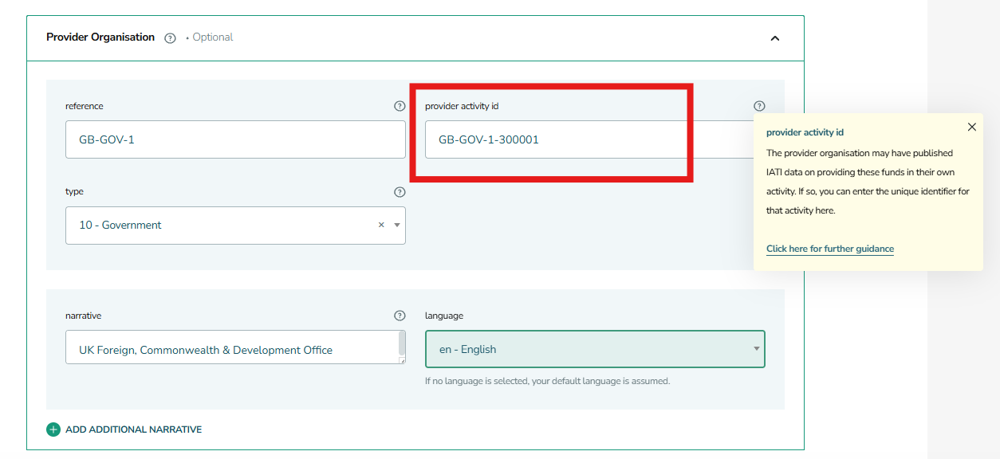

***************************************
How do I link my activity to my funder?
***************************************

Publishing links between your activity and your funder creates traceability — a visible chain from original donors through to implementing organisations. You do this in two places in your IATI activity data: participating organisations and transactions.

Steps to complete
-----------------

.. topic:: 1) Find your funder's identifiers
   
   Your funder should give you two identifiers: their IATI organisation reference (e.g. GB-GOV-1) and the IATI activity identifier for the specific     project funding you (e.g. GB-GOV-1-300001). If you don't have these yet, ask your funder or `search activities on d-portal <https://d-portal.iatistandard.org/>`_.

   If your funder doesn't have an IATI Organisation Identifier yet, include their name and organisation type. You can still link the activity once they start publishing.

.. topic:: 2) Add your funder as a participating organisation
   
   Use role = "Funding" (code 1) in the participating-org element of your activity.

   Include every organisation involved in the activity — funding, accountable, extending, and implementing. An organisation can hold multiple roles; list it once per role.
   

.. topic:: 3) Add incoming fund or commitment transactions
   
   Reference your funder's activity ID in the provider-org element.
   Incoming Funds (code 1) = money already received. Incoming Commitment (code 11) = money promised but not yet transferred. Publish commitments first, then the corresponding incoming fund when money arrives.

.. topic:: 4) Link parent / sibling activities (if applicable)
   
   Only needed if your activity is part of a programme with multiple sub-activities.
   If your organisation runs a programme with multiple activities (e.g. a parent programme and several country-level sub-activities), link them using related-activity.

Checklist before you publish
-----------------------------
- I have my funder's IATI organisation reference
- I have my funder's IATI activity identifier for this project
- My funder is listed under 'participating-org' with role = 1 (Funding)
- Each incoming transaction includes a 'provider-org' with @provider-activity-id
- My own organisation is listed under 'participating-org' (accountable or implementing role)
- I've included my own activity identifier in 'receiver-org' on each incoming transaction

----------------------------------------------------------------------------------------------------------------------------------

Examples
---------

In the example below, the UK Foreign, Commonwealth & Development Office is being referenced as the 'provider organisation' (i.e. funder). 

Within an activity transaction, enter your funder's IATI organisation reference (e.g. "GB-GOV-1" for FCDO), provider activity ID (e.g. "GB-GOV-1-300001" - change the end number accordingly), organisation name and type.

    *Figure 1: Where to populate the 'provider activity ID' within a transaction in IATI Publisher*

