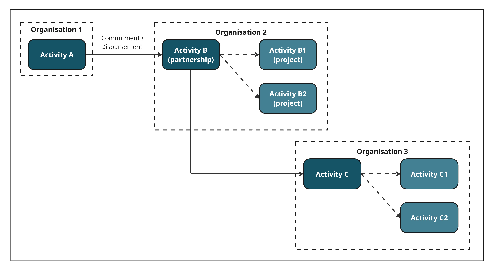

.. _`partnerships`:
******************
3) Partnerships
******************

A partnership is when your organisation works in a network or strategic alliance. Funding is generally received by one lead organisation and divided amongst partners on a programmatic level. Each member of the alliance or network then manages its own activities.

Scenario
--------
- Organisation 1 funds Organisation 2, as lead organisation of a Partnership with Organisation 3.
- As part of Activity B, Organisation 2 starts Activities B1 and B2.
- As part of Activity B, Organisation 2 also transfers funds to Organisation 3 for its role in the Partnership.

