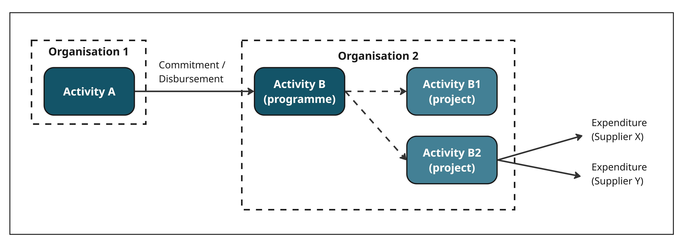
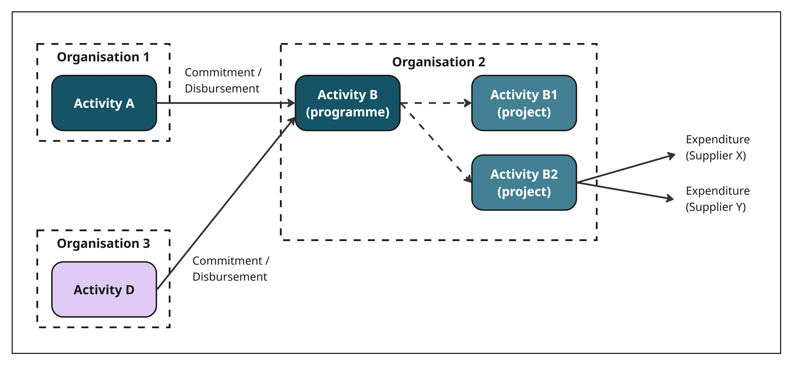

.. _`programme_funding`:
*********************
2) Programme funding
*********************

Programme funding applies where activities are divided into smaller sub-activities. Funds are usually managed at the parent level, while spending or transfers typically occur at the “child” level. 

This model can also accommodate situations where direct co-funding is received at the child level, as well as basket or pooled funding arrangements.

Example 1 - Programme-project structure
----------------------------------------------

- Organisation 1 funds Organisation 2 to carry out Activity B (a programme).
- As part of Activity B, Organisation 2 starts Activities B1 and B2 (projects within the programme).

Example 2 - Programme funding with multiple funders
---------------------------------------------------

- Organisation 1 funds Organisation 2 to carry out Activity B (a programme).
- Organisation 3 also funds Organisation 2 for the same Activity.
- As part of Activity B, Organisation 2 starts Activities B1 and B2 (projects within the programme).

