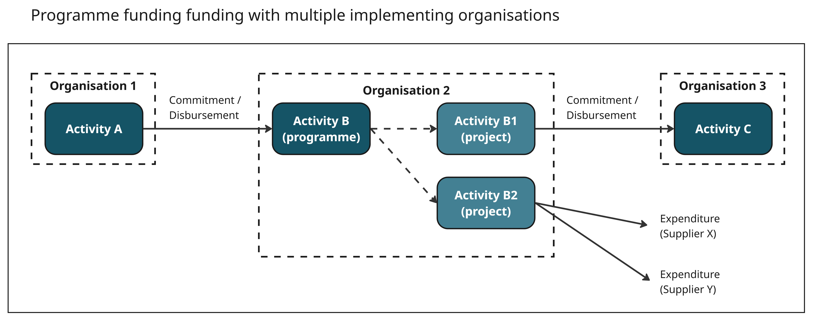

.. _`programme_funding`:
*********************
2) Programme funding
*********************

Programme funding applies where activities are divided into smaller sub-activities within the same organisation. Funds are usually managed at the 'parent' level, while spending or transfers typically occur at the 'child' level. 

This model can also cover situations where direct co-funding is received at the child level, as well as basket or pooled funding arrangements.

Scenario 1 - Programme-project structure
----------------------------------------------

- Organisation 1 funds Organisation 2 to carry out Activity B (a programme).
- As part of Activity B, Organisation 2 starts Activities B1 and B2 (projects within the programme).

.. figure:: images/programme_funding.jpg
    :width: 100 %
    :align: center
    :alt: diagram of programme funding

.. topic:: Example
   
   DanChurchAid is an international NGO that uses a parent-child hierarchy in their activity data. In this example, the Danish Ministry of Foreign Affairs is organisation 1 (the 
   funder) and DanChurchAid is organisation 2 (the implementing partner).

   - Activity A: `Folkekirkens Nødhjælp SPA 2022-2026 HUM <https://d-portal.iatistandard.org/ctrack.html#view=act&aid=XM-DAC-3-1-286697-35436>`_ (Denmark MFA)
   - Activity B: `Danida Strategic Partnership 2022-2026 HUM <https://d-portal.iatistandard.org/ctrack.html#view=act&aid=DK-CVR-36980214-DANIDA-SPA-2022-2025-HUM>`_ (DanChurchAid)
   - Activity B1: `2024 Zambia Drought Project <https://d-portal.iatistandard.org/ctrack.html#view=act&aid=DK-CVR-36980214-1010393-06>`_ (DanChurchAid)

   DanChurchAid publishes other child activities in this example (activities B2, B3, etc.)

------------------------------------------------------------------------------------------------------------------------------------------

Scenario 2 - Programme funding with multiple implementing organisations
-----------------------------------------------------------------------

- Organisation 1 funds Organisation 2 to carry out Activity B (a programme).
- As part of Activity B, Organisation 2 starts Activities B1 and B2 (projects within the programme).
- As part of Activity B2, Organisation 2 funds Organisation 3 to carry out Activity C.

------------------------------------------------------------------------------------------------------------------------------------------

Scenario 3 - Programme funding with multiple funders
---------------------------------------------------

- Organisation 1 funds Organisation 2 to carry out Activity B (a programme).
- Organisation 3 also funds Organisation 2 for Activity B.
- As part of Activity B, Organisation 2 starts Activities B1 and B2 (projects within the programme).

.. figure:: images/programme_funding_with_multiple_funders.jpg
    :width: 100 %
    :align: center
    :alt: diagram of programme funding with multiple funders
