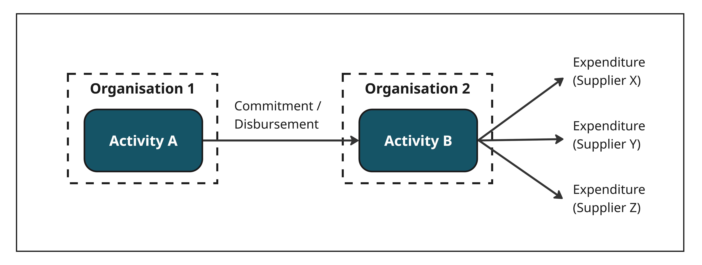
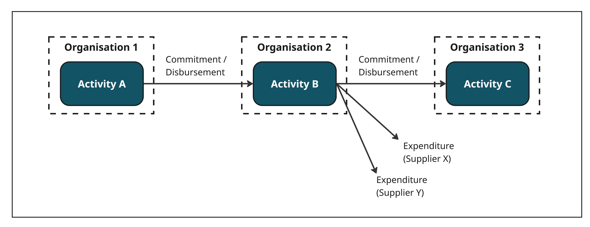

.. _`project_funding`:
********************
1) Project funding
********************

An organisation receives project funding to carry out a specific activity. It can either do the work itself (resulting in direct expenditure) or pass funding to other implementing partners.

Scenario 1 - Simple project funding
----------------------------------
- Organisation 1 funds Organisation 2 to carry out Activity B.
- Organisation 2 carries out the activity itself, incurring direct expenditure.
- No funds are passed on to other implementing organisations.

-------------------------------------------------------------------------------------------------------------------------------------------------

Scenario 2 - Project funding with multiple implementing organisations
--------------------------------------------------------------------
- Organisation 1 funds Organisation 2 to carry out Activity B.
- Organisation 2 carries out part of Activity B itself, incurring direct expenditure.
- Organisation 2 also funds Organisation 3 to carry out Activity C as part of Activity B.

**Example:** Carbon Trust is a not-for-profit that receives UK government funding. It passes some of this funding to implementing partners — such as the University of Cape Town — and reports these disbursements in its activity data.

* Activity A: `TEA - Research Programme Delivery Consortium (RPDC) via Carbon Trust <https://d-portal.iatistandard.org/ctrack.html#view=act&aid=GB-1-204867-113>`_ (UK FCDO)
* Activity B: `Transforming Energy Access (TEA) Platform <https://d-portal.iatistandard.org/ctrack.html#view=act&aid=GB-COH-06274284-GB-COH-06274284-TEA>`_ (Carbon Trust)
* Activity C: `Transforming Energy Access - Learning Partnership <https://d-portal.iatistandard.org/ctrack.html#view=act&aid=XI-GRID-grid.7836.a-404642>`_ (University of Cape Town)
